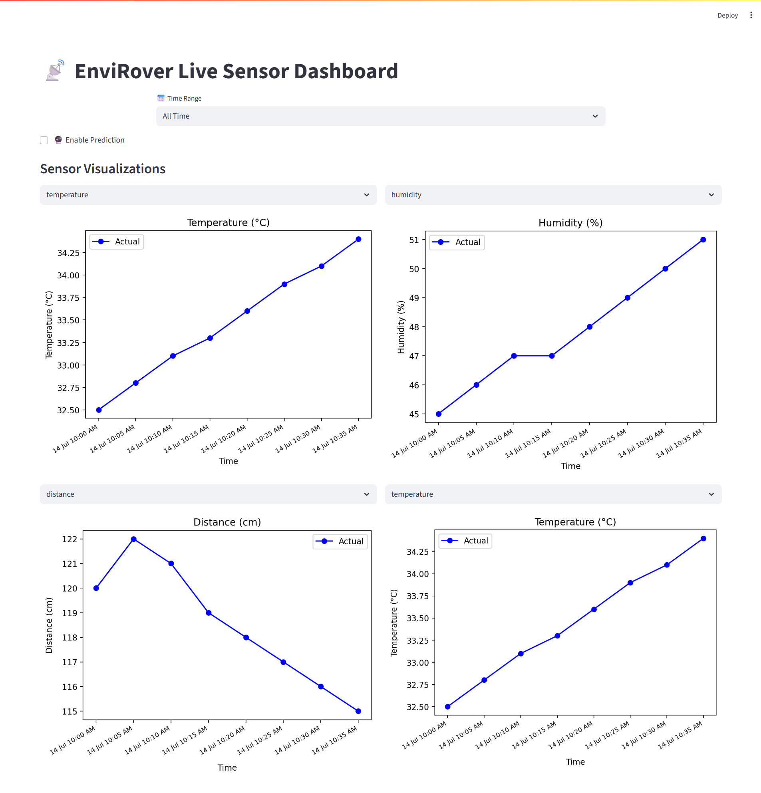

# EnviRover-Visualizer

A [Streamlit](https://streamlit.io) -based dashboard to visualize live sensor data we receive from [EnviRover](https://github.com/hbp275/Envi-Rover?tab=readme-ov-file#envirover)  , including various readings. The dashboard supports time-range filtering, predictive modeling, and interactive visualizations.

## Screenshots
Here’s a preview of how the EnviRover Visualizer Dashboard looks:

## Features

- Multiple sensor visualizations with selectable sensor types
- Time range filters:
   - All Time
   - Last 7 Days
   - Today
   - Last 1 Hour
- Toggleable AI-based prediction of sensor data trends
- Responsive UI with multiple graphs and controls
- Live data loading with fallback to recent stored data 

## Dependencies 

| Package        | Purpose                                                            |
| -------------- | ------------------------------------------------------------------ |
| [streamlit](https://streamlit.io)    | Main framework to build and run the interactive web dashboard      |
| [pandas](https://pandas.pydata.org)       | For reading, cleaning, and manipulating the CSV sensor data        |
| [matplotlib](https://matplotlib.org)   | Used for plotting sensor values on line charts                     |
| [numpy](https://numpy.org)        | Used for numerical operations (especially during prediction steps) |
| [scikit-learn](https://scikit-learn.org) | Used to run linear regression for predicting future sensor values  |

 ## Repository Structure
 <pre>
📁 EnviRover-Visualizer/
│
├── EnviRover-Visualizer
│       └── How to USE.txt
│       └── app.py
│       └── requirements.txt
│       └── Images
│       └── data
│             └── ReadMe.txt
│             └── sample_data.csv
├── README.md  </pre>  

## How to USE
See the [How to USE file](https://github.com/hbp275/EnviRover-Visualizer/blob/main/EnviRover-Visualizer/How%20to%20USE.txt) for usage instructions!
